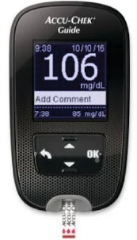

# Product

## table of contents

- [Product](#product)
  - [table of contents](#table-of-contents)
    - [Description](#description)
    - [Why](#why)
    - [Glossary](#glossary)

### Description

Mirror health is a mirror who allows you to take your pulse, your temperature, control your diabete, determine if you are alcoholic.
For that, many devices are integrate inside the mirror like termometer laser, propac [^1] glucose meter [^2] or also a an breathalyzer [^3].
We can also imagine the possibility to see make up tuto on YouTube, make some research on Google or call with camera, or not, someone.

### Why

In my family, we are the high risk type when it comes to cancer and disease. I once watched the movie "Seven Sisters" and saw the mirror that described every flaw in their face.
So, I decided to inspire me of this movie and of this idea, to make it a reaality. allows to people to take care of themselves in front of their mirror.
Everyone have a mirror at home.

___

### Glossary

[^1]: propac

Medical object used by hospitals and emergency services for pulse oximetry with a clamp

[^2]: glucose meter

It's a device allows to mesure the concentration of glucose in the blood thanks a little needle and a strip glucose paper dipped

[^3]: breathalyzer

https://www.ebay.fr/itm/224971220617?chn=ps&mkevt=1&mkcid=28#rpdCntId
Device which evaluate if you are alcoholic thanks to sensors that analyze the air when you blow.
