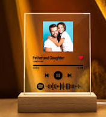
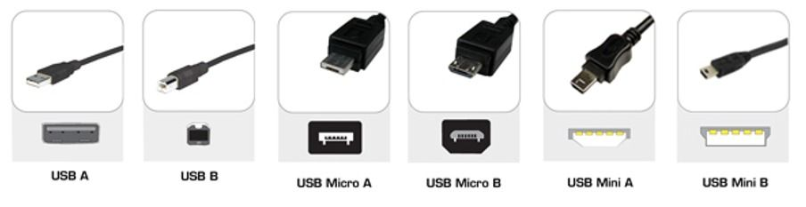
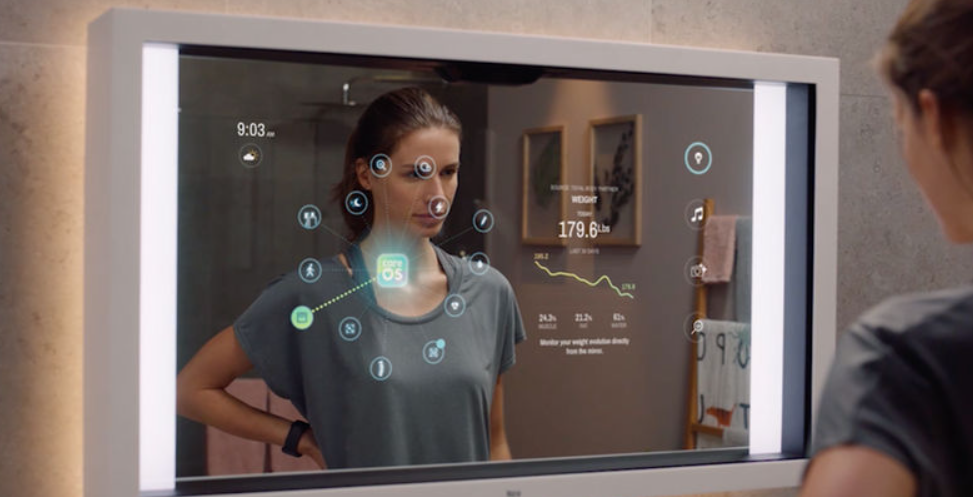
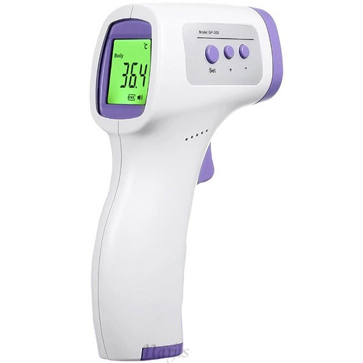
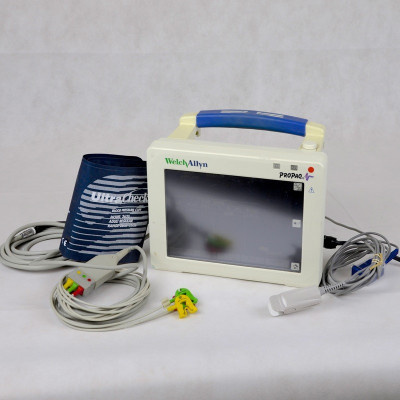

# Moonshot Project

## Table of contents

- [Moonshot Project](#moonshot-project)
  - [Table of contents](#table-of-contents)
    - [Music playlist](#music-playlist)
    - [Miror health](#miror-health)

### Music playlist

Wooden base with functional Plexiglas screen (like Spotify Glass[^2], the product of Spotify above) in which you can record playlists (0,1,2,3,4,5,6,7,8,9) via a USB micro B port and a USB A / USB type A cable to connect to a computer.

We can display the music via a small integrated speaker or by Bluetooth connection to speakers.

### Miror health

A mirror who describes your health :
- fever with a temperature sensor like the termometer gun

- heart rate with a digital sensor like propac [^1]

[^1]: propac
medical object used by hospitals and emergency services for pulse oximetry with a clamp

[^2]: Spotify Glass
Spotify has already developed an identical system but on which you only burn music and to listen to the music you have to scan the plate. There is no system and you can buy them for 10€ to have your favorite music in your decoration.